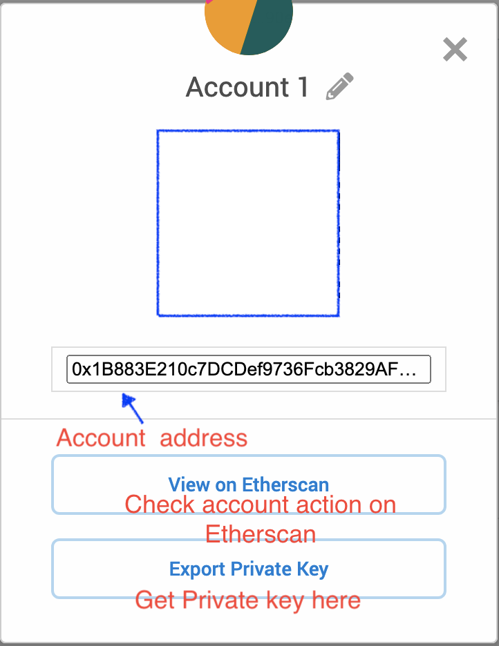

Lab 1: Blockchain Storage and Mining on Campus
===

In this lab, you are given the initial state that a custom Blockchain network of several miners is hosted on an on-campus machine which has been running for several days before the class. The Blockchain machine also runs a daemon that periodically instructs some miner to conduct transactions with other miners.

- Link of this lab (raw): https://goo.gl/gAU8nq
- Link to genesis.json: https://goo.gl/onnjb4 

Prerequisite
---

1. Linux shell commands
2. Understand [Ethereum](http://www.ethdocs.org/en/latest/introduction/index.html)

Lab Environment Setup
---

In this section, firstly,  we need to install **Python3** to your computer or VM. And you can find the install instruction [here](https://www.python.org/downloads/)

For Mac and Linux users, you can try the following script in your terminal to verify your installation(will return the version number):

```bash
python3  --version
```

For windows user you can download the [windows terminal](https://www.microsoft.com/en-us/p/windows-terminal/9n0dx20hk701?rtc=1&activetab=pivot:overviewtab) then use same script to verify the installation, also using VM is an option.

Install  web3 library `pip3 install web3`


#### Install VM(optional)

Install VirtualBox on your computer: https://www.virtualbox.org/wiki/Downloads . Choose `Ubuntu-64` bit option while installing the VM.

Download our prebuilt VirtualBox image from [[here](https://drive.google.com/file/d/19_U2UmsnZmMGRwe4AxMlfYoEot-xZ7Br/view?usp=sharing)]. Make sure this image runs with more than 4 GB memory. There is a user `user1` and the password is `blockchainsu`. 

Copy this online file [[link](https://raw.githubusercontent.com/syracuse-fullstacksecurity/SUBlockchainLabs/master/lab3.1/genesis.json)] to the gedit and save it (by hitting `control+S` in Ubuntu).


### 2. Join the Blockchain network

#### 2.1 Access to Infura API:

- Visit https://infura.io/  and sign up account

- Under https://infura.io/dashboard/ethereum and `create new project`

- Get into the project you just created, then go to setting. Under `Keys​` section, change `ENDPOINTS` to **ROPSTEN** you will find your link, should be like this:
  


  

  Keep the first URL start with "https://ropsten.infura.io", and try the script below( [cURL install](https://help.ubidots.com/en/articles/2165289-learn-how-to-install-run-curl-on-windows-macosx-linux)):

  ```bash
  curl -X POST \
  -H "Content-Type: application/json" \
  --data '{"jsonrpc": "2.0", "id": 1, "method": "eth_blockNumber", "params": []}' \
  "YOUR URL HERE"
  ```

#### 2.2 Create your Ethereum account on ROPSTEN via MetaMask

- Install metamask on chrome via [link here](https://chrome.google.com/webstore/detail/metamask/nkbihfbeogaeaoehlefnkodbefgpgknn)

- Create a wallet, after creation you will see the following page and switch ROPSTEN

  

- Click the three dot button, you see more detail about your account and we need to Export Private Key, keep both value somewhere safe:

  

#### 2.2 Get Coin from faucet

Here is the faucet to request Ether on Ropsten: https://faucet.metamask.io/
After 1 or 2 min you should got the ether and you can view it on etherscan.


### 3A. Send Coins by Transactions

**_Script 3a.1_**:  get_balance.py

```python
from web3 import Web3

# link to infura
infuraurl = "YOUR ROPSTEN URL"
web3 = Web3(Web3.HTTPProvider(infuraurl))
print(web3.isConnected())

# transaction info
sender = "SENDER ACCOUNT ADDRESS"

# query
print(web3.eth.getBalance(sender))
```

Run script with `python3 get_balance.py `


**_Script 3a.2_**: send_transaction.py


```bash
from web3 import Web3

# link to infura
infuraurl = "YOUR ROPSTEN URL"
web3 = Web3(Web3.HTTPProvider(infuraurl))
print(web3.isConnected())

# transaction info
sender = "SENDER ACCOUNT ADDRESS"
sender_privateKey = "SENDER PRIVATEKEY"
receiver = "RECEIVER ACCOUNT ADDRESS"
amount = web3.toWei('0.1', 'ether')

# build transaction
nonce = web3.eth.getTransactionCount(sender)

raw_transaction = {
  'to': receiver,
  'value': amount,
  'gas': 2000000,
  'gasPrice':  web3.toWei('10', 'gwei'),
  'nonce': nonce,
  'chainId': 3
}
# sign transaction
signed_txn_transfer = web3.eth.account.signTransaction(raw_transaction, sender_privateKey)

# send transaction
TxHash_transfer = web3.eth.sendRawTransaction(signed_txn_transfer.rawTransaction)
tx_receipt_transfer = web3.eth.waitForTransactionReceipt(TxHash_transfer)
```

Run with `python3 send_transaction.py`


Lab Tasks
---

The tasks in this lab require to inspect and modify the content of Blockchain. In addition to the Ethereum commands you used  above, there are other relevant commands as below.

```bash
python3
> web3.eth.getBalance(<account>) # check the balance for one account, the argument is account id
> web3.fromWei(<value>,"ether") # convert Wei to Ether
> web3.toWei(<value>,"ether") #convert Ether to Wei
> web3.eth.blockNumber # check the latest block number on the chain
> web3.eth.getBlock(eth.blockNumber-3) # display a certain block 
> web3.eth.getBlock('latest', True) # display the latest block
> web3.eth.getBlock('pending', True) # display the pending block
> web3.eth.getTransaction("0x8ef6a4f7ed9d5a6db17c47386d9a03fd878c813ace92d5b1463cf3bdecbba756")
```


Note 1: The above command will return a hash tag which served as the ID of the transaction, you could use that ID to query the transaction in the future.

Note 2: [Ether](http://www.ethdocs.org/en/latest/ether.html) is the name of the currency used within Ethereum. Wei is the smallest unit in Ethereum. 1 Ether = 10^18 Wei. The account balance and transfer amount are shown in Wei. You can use the converter utility web3.fromWei and web3.toWei to convert between Ether and Wei. 


Deliverable
---

- For each task, the deliverable includes the following:
  1. The script program of the Geth commands
  2. The screenshot that shows your script has run successfully on your computer
     - Make sure include your name in the screenshot. You can, for example, open a text editor with your name in it. 

