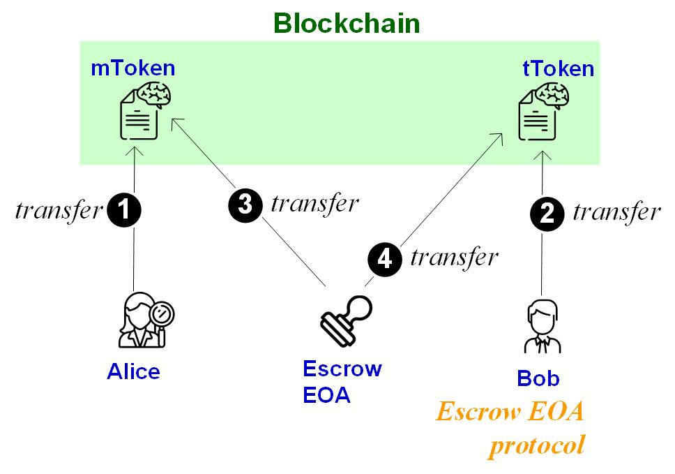
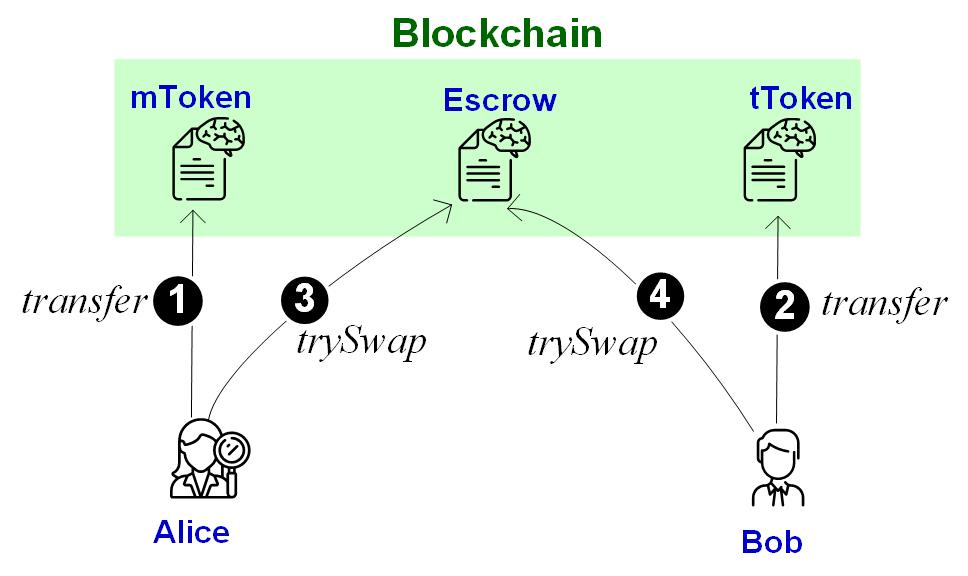

Lab 3: Tokens and DEX
===

Introduction
---

DEX or decentralized exchange supports the swap of token ownership between different accounts. A swap is essentially two transfers, one from Alice to Bob and the other from Bob to Alice. A swap is supposed to be atomic, in the sense that either both transfers occur or no transfer occurs. In this lab, you are going to implement a DEX supporting atomic swap settlement.
 

| Tasks | CS student | Finance student
| --- | --- | --- |
|  1  | Required | Required |
|  2  | Required | Required |
|  3  | Required | Bonus |
|  4  | Required | Bonus |
|  5  | Bonus | Bonus |

Task 1. Execute token transfer 
---

The following smart contract implements a very simple token supporting the essential transfer function: `transfer(address sender, address recipient, uint256 amount)` 

```
pragma solidity >=0.7.0 <0.9.0; 
contract MyToken {  
  uint _totalSupply = 0; string _symbol;  
  mapping(address => uint) balances;  
  constructor(string memory symbol, uint256 initialSupply) {
    _symbol = symbol;
    _totalSupply = initialSupply;
    balances[msg.sender] = _totalSupply;  }  
  function transfer(address receiver, uint numTokens) public returns (bool) {    
    require(numTokens <= balances[msg.sender]);        
    balances[msg.sender] = balances[msg.sender] - numTokens;    
    balances[receiver] = balances[receiver] + numTokens;    
    return true;  
}}

```

Your job in this task is to deploy the above smart contract in Remix, creating an mToken instance. Demonstrate the process that the mToken issuer transfers 10 mToken to another account, say Alice.

Task 2. Execute atomic swap settlement in one transaction (by escrow EOA)
---

An atomic swap occurs between two accounts in two tokens. Suppose Alice of token mToken wants to trade her mTokens for Bob’s tTokens. For simplicity, we assume the exchange rate between mToken and tToken is always 1:1 (i.e., one mToken for one tToken). A swap incurs a transfer from Alice to Bob in mToken and another transfer from Bob to Alice in tToken.

A simple swap protocol is to do the two transfers in one transaction. This requires Alice and Bob (two EOAs) first transfer tokens to a trusted third-party account, that is, the escrow. After the escrow receives both Alice's mToken and Bob's tToken, the escrow then sends mToken to Bob and tToken to Alice, to settle the swap. 

There are different instanstiation of the escrow protocol. One is to materialize an escrow as an EOA. In this case, the escrow EOA is trusted to send the two transfer calls, atomically. The following figure illustrates the escrow-EOA protocol.



Your job in this task is to deploy your token smart contracts, from Task 1, twice (first as mToken and then as tToken). Run the above escrow-EOA protocol to complete the swap of Alice's mToken and Bob's tToken. 

Task 3. Design and implement atomic swap settlement in one transaction (by escrow smart contract)
---

Another approach is to impelment the escrow in a smart contract. In this case, after Alice and Bob transfer their tokens to the escrow smart contract (in Step 1 & 2), they then notify the escrow smart contract. After receiving both Alice and Bob's notification, the escrow smart contract sends two transfers, atomically, that is, first to tranfer mToken to Bob and then to transfer tToken to Alice. The following figure illustrates the escrow-smart-contract protocol.



Your job is to:

1. Implement the escrow smart contract described as above. Then run an atomic swap by deploying the token smart contracts (twice respectively as mToken and tToken instances) and the escrow smart contract.
2. Design the failure handling protocol by extending the above escrow smart contract. One failure case is that Alice (or Bob) did not transfer her mTokens (his tTokens) to the escrow. In this case, Alice (Bob) should be able to withdraw her mTokens (his tTokens) after a predifined timeout, say *t* blocks. Use `block.number` to access the current block height in solidity.

Task 4: Design and implement the swap between token and Ether
---

Revise your escrow smart contract to support the swap between Ether and mToken. For instance, Alice trades her mToken for Bob's Ether. Design the protocol as above and implement it in the escrow smart contract. Here, you can assume one mToken is exchangeable with one Ether.

Consider both cases of success and failed swaps.

Task 5. Design and implement order matchmaking 
---

So far, you build a DEX's swap settlement layer. This is an incomplete DEX, as it only supports the fixed exchange rate between mToken and tToken. 

Now you are to build a full fledged DEX by supporting an order matchmaking layer. Order matchmaking supports the exchange rate that are dynamically set.

You have two choices: Either implement an AMM mechanism or an order-book. 

- Hint 1: If you choose to implement an on-chain AMM (just like Uniswap), you should consider revising/extending your solution of Task 3: Bob should be a smart contract account. 
- Hint 2: If you choose to implement an off-chain orderbook (just like IDEX), you should consider revising/extending your solution of Task 3: In Step 3/4, Alice and Bob should send their acceptable exchange rates to another EOA controlled by the off-chain orderbook.


Deliverable
---

- For all tasks, you should 1) submit your smart-contract code, and 2) show the screenshot of the program execution. 
