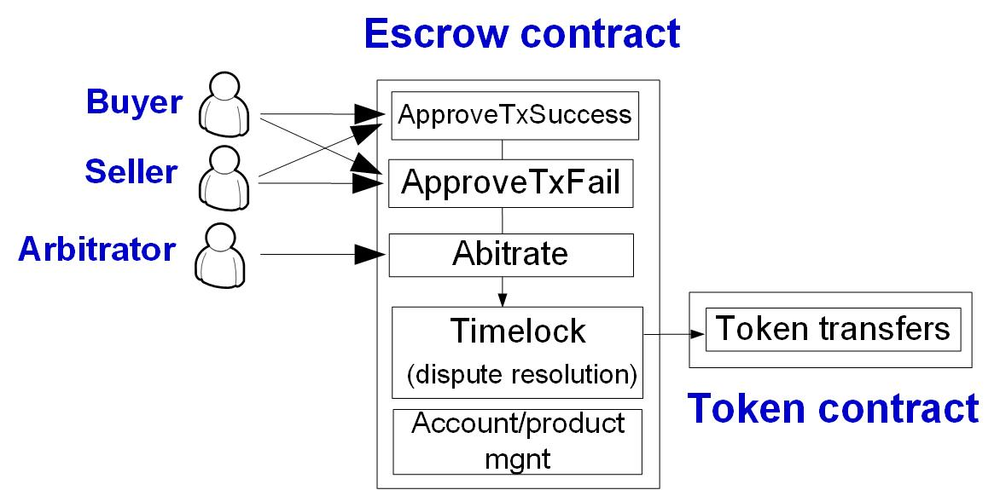

Lab 4: Escrow Services and Applications
===

Introduction
---

An escrow is a trusted service that manage counter-party risks and helps establish trust between a seller and a potential buyer. In real life, an escrow service is backed by banks and is useful in many financial and supply-chain scenarios (e.g., buying a house). In this lab, you are required to implement an escrow service on Ether and custom tokens.

System design
---

The protocol works as below: At the beginning, the buyer makes a security deposit to the escrow service. Then, it proceeds to execute the transaction between the buyer and seller. In the end, if both the seller and buyer agree on the successful execution of transaction, the escrow service will transfer the payment to the seller. There is also a chance that the buyer and seller have a dispute; in this case, the escrow service hold back from sending the payment to the seller and relies on a trusted party to arbitrate the transaction outcome. Depending on the outcome, it may refund the buyer or pay to the seller. The workflow of escrow service is listed below:

1. The buyer sends a security deposit to the escrow service. 
2. (Case 1): The transaction is successful and is agreed upon between the buyer and the seller. Signaled by both parties, the escrow service proceeds to send the deposit to the seller. 
4. (Case 2): The transaction fails and the failed state is agreed upon between the buyer and seller. Signaled by both parties, the escrow service proceeds to refund the buyer.
3. (Case 3): There is a dispute about the state of transaction. For instance, the buyer may think the transaction finishes successfully but the seller may think the opposite. In this case, an off-chain trusted party is used to arbitrate the transaction state and will tell the escrow service of her decision. Depending on the result, the escrow service may refund the buyer or pay the seller.
- Note that in all cases, the escrow service should collect certain amount of security deposit for the service fee (e.g., 1% of the security deposit).

Refer to [[link](https://www.investopedia.com/terms/e/escrow.asp)] and [[link](https://www.escrow.com/what-is-escrow)] for more details about the escrow services.

A natural design is to implement a smart contract to play the role of escrow service. Here, your escrow smart contract should manage, in addition to its own address, three external accounts (**EOA**): a seller, a buyer and an arbitrator. Each account is associated with balance in certain **tokens**. For simplest impl., you can hard-code the buyer/seller addresses, and use Ether as the default token. 

Task 1: Buyer and seller agree on the transaction state
---

Impl. the smart escrow contract that supports the following functions:

- `MakeDeposit()` which allows the buyer to send the payment/security deposit to the smart contract. The payment should be the price of product plus service fee (1%).
- `ApproveTxSuccess()` which allows only the buyer or seller to send their approval and to signal the success of transaction. Only both parties approve, the contract sends the payment to the seller.
- `ApproveTxFail()` which allows only the buyer or seller to send their approval and to signal the failure of transaction. Only both parties approve, the contract refunds the payment back to the buyer.

Task 2: Dispute resolution
---

Dispute occurs when the seller sends `ApproveTxFail()` and the buyer sends `ApproveTxSuccess()` (or vice versa). When this happens, the escrow contract enters the following time-lock logic: It will wait for the input of an off-chain arbitrator via function `Arbitrate()`. If such an input is not received for the 2 minutes, the contract will time-out and refund the deposit to the buyer.

- Implement Function `Timelock()`, such that the smart contract waits for 2 minutes (or 12 Ethereum blocks) for the event of `Arbitrate()` invocation. If the timeout is reached, it refunds. The function `Timelock()` should be called by `ApproveTxSuccess()`/`ApproveTxFail()`.
- Implement Function `Arbitrate()` which is supposed to be called by account arbitrator. The arbitrator decides the transaction state and the function takes action to refund the buyer (upon the transaction failure) and to pay for the seller (upon the transaction success).

Task 3: Support custom tokens
---

In this task, you are required to implement a simple token and use it to support the smart escrow contract.

- Implement a simple token contract `SimpleToken` that supports function `transfer(address sender, address recipient, uint256 amount)` 
- Use the token to back the accounts of buyer and seller in the smart escrow contract.

<!--

contract SimpleToken {
    mapping (address => uint256) private _balances;
    function transfer(address sender, address recipient, uint256 amount) internal {
        if ( _balances[sender] - amount < 0) throw;
        _balances[sender] -= amount;
        _balances[recipient] += amount;
    }
}

-->

Bonus Task (20%) 
---

Deploy and run the code of all previous tasks on our on-campus Blockchain. Include screenshots of the results in your report. You can use [[this tutorial](https://github.com/BlockchainLabSU/SUBlockchainLabs/blob/master/lab2/README_solc.md)] as a reference of how to deploy smart contracts on the on-campus Blockchain.

