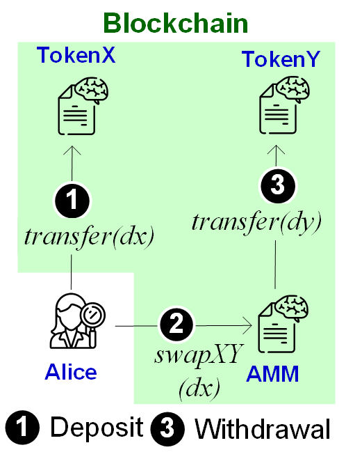
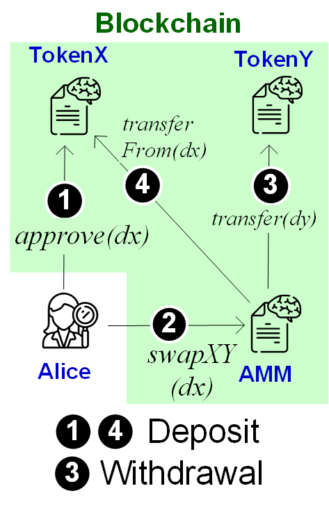

Lab B1: AMM DEX
===

Introduction
---

An automated market maker (AMM) is a decentralized-exchange (DEX) protocol. In an AMM, a trader does not directly trade with other traders. Instead, they trade with a smart-contract intermediary. In practice, AMM gets more widely adopted than other DEX forms (e.g., order book). For instance, the most popular DEX services, including Uniswap, Sushiswap, Pancakeswap, etc., all follow AMM protocols. In this lab, you will implement an AMM smart contract.


| Tasks | Points | CS student | Finance student |
| --- | --- | --- | --- |
|  1  | 20 |  Required | Bonus |
|  2  | 30 | Required | Bonus |
|  3  | 50 | Required | Bonus |


Exercise 1. Execute token transfer
---

The following smart contract implements a very simple token supporting the essential transfer function: `transfer(address sender, address recipient, uint256 amount)` 

```
pragma solidity >=0.7.0 <0.9.0; 
contract BaddToken {  
  uint _totalSupply = 0; string _symbol;  
  mapping(address => uint) balances;  
  constructor(string memory symbol, uint256 initialSupply) {
    _symbol = symbol;
    _totalSupply = initialSupply;
    balances[msg.sender] = _totalSupply;  
  }
  
  function transfer(address receiver, uint amount) public returns (bool) {    
    require(amount <= balances[msg.sender]);        
    balances[msg.sender] = balances[msg.sender] - amount;    
    balances[receiver] = balances[receiver] + amount;    
    return true;  
  }

  function balanceOf(address account) public view returns(uint256){
    return balances[account];
  }}
```

Your job in this exercise is to deploy the above smart contract in Remix, creating an `TokenX` instance. Demonstrate the process that the `TokenX` issuer transfers 10 `TokenX` to another account, say Alice, and display each account's balance before/after the transfer.


Exercise 2. Basic AMM Design with Fixed Rate
---



In the figure above, trader Alice first transfers $x$ units of `TokenX` from her account to an AMM pool's account. Then, she calls the AMM smart contract's function `swapXY(dx)`. Upon receiving Alice's transaction, the AMM smart contract internally calls `TokenY`'s `transfer` function to transfer $dy$ units of `TokenY` to Alice's account.

In this exercise, you can consider that $dy/dx = 2$. Implement the AMM smart contract.

```
pragma solidity >=0.7.0 <0.9.0; 
contract AMM {
  BaddToken tokenX, tokenY;
  // _tokenX and _tokenY are contract-addresses running BaddToken SC
  constructor(address _tokenX, address _tokenY){
    tokenX = BaddToken(_tokenX); tokenY = BaddToken(_tokenY);
  }

  function swapXY(uint amountX) public payable {
    // fill out the following with your code
  } 
}
```

- Workflow to execute your code:
    - Write and compile an `AMM` smart contract.
    - Deploy `BaddToken` smart contract twice, respectively to two contract addresses, say `_tokenX` and `_tokenY`.
    - Deploy `AMM` smart contract with `_tokenX` and `_tokenY`.
    - Execute the smart contracts in two steps: 
        - 1) call `_tokenX`'s `transfer` function
        - 2) call `AMM`'s `swapXY` function
- Hint: You need to make sure your account has enough tokens for both `_tokenX` and `_tokenY`.

Exercise 3. Constant-product AMM
---

Suppose the AMM account owns $x$ units of `TokenX` and $y$ units of `TokenY`. The AMM pool can use a function $f(x,y)$ to calculate the exchange rate between `TokenX` and `TokenY` on the fly. Specifically, it enforces that function value is constant before and after each token swap, that is,

$$f(x,y)=f(x+dx,y-dy)$$

In this exercise, you are asked to implement constant-product AMM (adopted in the real-life Uniswap), where $f(x,y)=x\*y$. Modify your AMM smart contract to support the constant-product invariant $x\*y=(x+dx)(y-dy)$.

- Hint: You may want to keep track of token balance $x$ and $y$ in the AMM smart contact by issuing `balanceOf` in each `swapXY` call.

| Case | tx1 | tx2 | Solution |
| --- | --- | --- | --- |
|  Normal case | Alice | Alice | Exercise 1-4 |
|  Dangling swap  | Alice | NULL | Exercise 5 (approve/transferFrom) |
|  Steal from pool  | NULL | Alice | Exercise 5 (Track deposits) |
|  Steal from Bob   | Bob  | Alice | Exercise 6 |

Exercise 4. Supporting Token Approve/transferFrom
---




Exercise 5. Security against Pool Theft
---


Exercise 6. Security against Trader Theft
---


Deliverable
---

- For all tasks, you should 1) submit your smart-contract code, and 2) show the screenshot of the program execution. 

