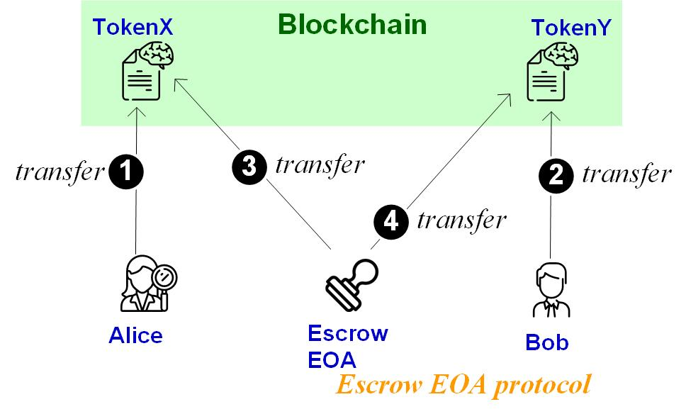
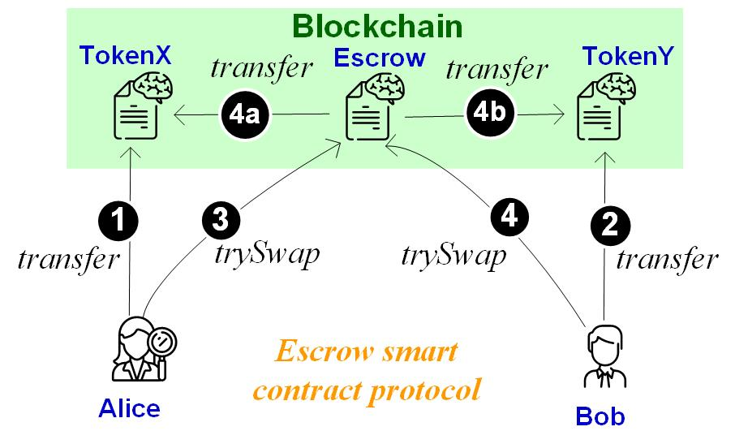

Lab B1: DEX 1: Swap settlement
===

Introduction
---

DEX or decentralized exchange supports the swap of token ownership between different accounts. A swap is essentially two transfers, one from Alice to Bob and the other from Bob to Alice. A swap is supposed to be atomic, in the sense that either both transfers occur or no transfer occurs. In this lab, you are going to implement a DEX supporting atomic swap settlement.
 

| Exercises | CS student | Finance student
| --- | --- | --- |
|  1  | Required | Required |
|  2  | Required | Required |
|  3  | Required | Bonus (50%) |
|  4  | Required | Bonus (50%) |
|  5  | Bonus (50%) | Bonus (100%) |

Exercise 1. Execute token transfer 
---

The following smart contract implements a very simple token supporting the essential transfer function: `transfer(address sender, address recipient, uint256 amount)` 

```
pragma solidity >=0.7.0 <0.9.0; 
contract MyToken {  
  uint _totalSupply = 0; string _symbol;  
  mapping(address => uint) balances;  
  constructor(string memory symbol, uint256 initialSupply) {
    _symbol = symbol;
    _totalSupply = initialSupply;
    balances[msg.sender] = _totalSupply;  
  }
  
  function transfer(address receiver, uint amount) public returns (bool) {    
    require(amount <= balances[msg.sender]);        
    balances[msg.sender] = balances[msg.sender] - amount;    
    balances[receiver] = balances[receiver] + amount;    
    return true;  
  }

  function balanceOf(address account) public view returns(uint256){
    return balances[account];
  }}
```

Your job in this exercise is to deploy the above smart contract in Remix, creating an TokenX instance. Demonstrate the process that the TokenX issuer transfers 10 TokenX to another account, say Alice, and display each account's balance before/after the transfer.

Exercise 2. Execute atomic swap settlement in one transaction (by escrow EOA)
---

An atomic swap occurs between two accounts in two tokens. Suppose Alice of token TokenX wants to trade her TokenXs for Bob's TokenYs. For simplicity, we assume the exchange rate between TokenX and TokenY is always 1:1 (i.e., one TokenX for one TokenY). A swap incurs a transfer from Alice to Bob in TokenX and another transfer from Bob to Alice in TokenY.

A simple swap protocol is to do the two transfers in one transaction. This requires Alice and Bob (two EOAs) first transfer tokens to a trusted third-party account, that is, the escrow. After the escrow receives both Alice's TokenX and Bob's TokenY, the escrow then sends TokenX to Bob and TokenY to Alice, to settle the swap. 

There are different instanstiation of the escrow protocol. One is to materialize an escrow as an EOA. In this case, the escrow EOA is trusted to send the two transfer calls, atomically. The following figure illustrates the escrow-EOA protocol.



Your job in this exercise is to deploy your token smart contracts, from Exercise 1, twice (first as TokenX and then as TokenY). Run the above escrow-EOA protocol to complete the swap of Alice's TokenX and Bob's TokenY. 

Exercise 3. Design atomic swap settlement in one transaction (by escrow smart contract)
---

Another approach is to impelment the escrow in a smart contract. In this case, after Alice and Bob transfer their tokens to the escrow smart contract (in Step 1 & 2), they then notify the escrow smart contract. After receiving both Alice and Bob's notification, the escrow smart contract sends two transfers, atomically, that is, first to tranfer TokenX to Bob and then to transfer TokenY to Alice. The following figure illustrates the escrow-smart-contract protocol.



Your job is to:

1. Implement the escrow smart contract described as above. Then run an atomic swap by deploying the token smart contracts (twice respectively as TokenX and TokenY instances) and the escrow smart contract.
2. Design the failure handling protocol by extending the above escrow smart contract. One failure case is that Alice (or Bob) did not transfer her TokenXs (his TokenYs) to the escrow. In this case, Alice (Bob) should be able to withdraw her TokenXs (his TokenYs) after a predifined timeout, say *t* blocks. Use `block.number` to access the current block height in solidity.

- Hint: To make smart contract `X` call smart contract `Y`'s function `foo`, you can pass to `X` `Y`'s contract address say `CA_Y` so that in `X` the following statement calls `CA_Y`'s function `foo`: `(Y)CA_Y.foo();` 

Exercise 4: Design the swap between token and Ether
---

Revise your escrow smart contract to support the swap between Ether and TokenX. For instance, Alice trades her TokenX for Bob's Ether. Design the protocol as above and implement it in the escrow smart contract. Here, you can assume one TokenX is exchangeable with one Ether.

Consider both cases of success and failed swaps.

Deliverable
---

- For all exercises, you should 1) submit your smart-contract code, and 2) show the screenshot of the program execution. 
