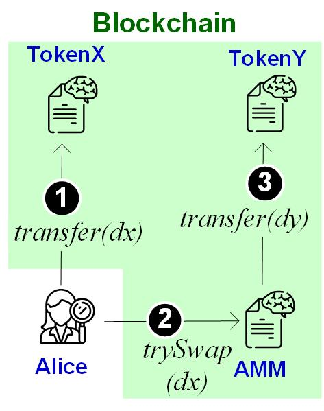

Lab B2: DEX 2: AMM and Pricing
===

Introduction
---

An automated market maker (AMM) is a decentralized-exchange (DEX) protocol. In an AMM, a trader does not directly trade with other traders. Instead, they trade with a smart-contract intermediary. In practice, AMM gets more widely adopted than other DEX forms (e.g., order book). For instance, the most popular DEX services, including Uniswap, Sushiswap, Pancakeswap, etc., all follow AMM protocols. In this lab, you will implement an AMM smart contract.


| Tasks | Points | CS student | Finance student |
| --- | --- | --- | --- |
|  1  | 20 |  Required | Bonus |
|  2  | 40 | Required | Bonus |
|  3  | 40 | Required | Bonus |


Exercise 1. Impl. an ERC20 token SC
---

Write and compile a Token smart contract that materializes the following interface.

```
pragma solidity ^ 0.4.25;
interface IERC20 {
  function transfer(address recipient, int256 amount) external returns (bool);
}
```

Exercise 2. Impl. an fixed-rate AMM (1:2)
---



In the figure above, trader Alice first transfers `dx` units of TokenX from her account to an AMM pool's account. Then, she calls the AMM smart contract's function `trySwap(dx)`. Upon receiving Alice's transaction, the AMM smart contract internally calls TokenY's `transfer` function to transfer `dy` units of TokenY to Alice's account.

In this exercise, you can consider that dy/dx = 2. Implement the AMM smart contract.

```
contract AMM {
  IERC20 tokenX, tokenY;
  // _tokenX is a CA running TokenX’s smart contract
  constructor(address _tokenX, address _tokenY){
    tokenX = IERC20(_tokenX); tokenY = IERC20(_tokenY);
  }

  function swapXY(uint amountX) public payable {
    // fill out the following with your code
  } 
}
```

- Workflow to execuse your code:
    - Write and compile a AMM smart contract
    - Deploy the Token SC (in Exercise 1) twice, respectively to addresses `_tokenX` and `_tokenY`.
    - Deploy AMM smart contract with two token instances: `_tokenX` and `_tokenY`

Exercise 3. Impl. constant-product AMM
---

Suppose the AMM account owns `x` units of TokenX and `y` units of TokenY. The AMM pool can use a function `f(x,y)` to calculate the exchange rate between TokenX and TokenY on the fly. Specifically, it enforces that function value is constant before and after each token swap, that is,

`f(x,y)=f(x+dx,y-dy)`

In this exercise, you are asked to implement constant-product AMM (adopted in the real-life Uniswap), where `f(x,y)=x*y`. Modify your AMM smart contract to support  `x*y=(x+dx)(y-dy)`.


Deliverable
---

- For all tasks, you should 1) submit your smart-contract code, and 2) show the screenshot of the program execution. 

