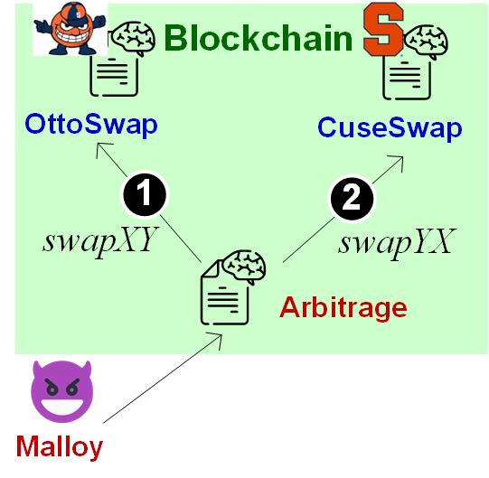
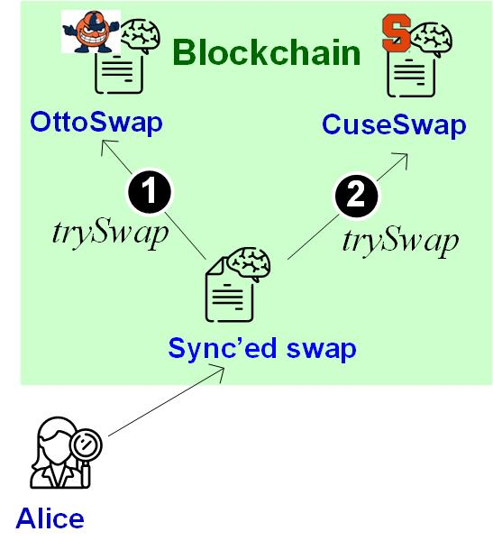

Lab B3: DEX security: Arbitrage 
===

Introduction
---

In traditional finance, arbitrage is defined as the purchase and sale of the same asset in different markets in order to profit from differences in exchange rate. The same attack applies to decentralized exchanges (DEXes), where an attacker trades with two DEX pools and exercise buy-low-sell-high strategy. 

In this lab you will pretend to be both the attacker and defender taking steps to exploit an arbitrage opportunity and to prevent it from happening.

Exercise 1. Arbitrage attacks on AMM pools
---

Let's assume there are two DEXes, Ottoswap and Cuseswap. Ottoswap was willing to trade 10 `TokenX` per `TokenY` and Cuseswap was willing to trade 300 `TokenX` per `TokenY`. Attacker Alice could buy 10 `TokenX` for 1 `TokenY` from Ottoswap and then trade 10 `TokenX` for 2 `TokenY` on Cuseswap yielding a 1 `TokenY` profit. 

While Alice can do the two trades in two separate transactions, Alice may  face the risk of failing one transaction and losing value. In practice, attackers commonly deploy a smart contract to send the two trade transactions atomically in order to guarantee the attack success and profitability. 

Your job is to create an arbitrage smart contract that collects the arbitrage profit. The setting is shown in the above diagram, including the two token contracts, `TokenX` and `TokenY`, and their exchange rates on the two DEXes (Ottoswap and Cuseswap). 

Your arbitrage smart contract should invoke Ottoswap's swap function to trade `TokenY` for `TokenX` and then invoke Cuseswap's swap function to trade `TokenX` for `TokenX`. Your arbitrage smart contract should print its initial balance and the balance in the end.

In this exercise, you will be given the code of a CP-AMM (constant product) smart contract and run your arbitrage smart contract against the AMM. You will need to show the profit extracted by the arbitrage.

Instructions:

- Deploy `MyToken` SC twice to create instances of `TokenY` and `TokenX`.
- Deploy the given `CP-AMM` SC twice to create instances of `Ottoswap` and `Cuseswap`; each instance is against both `TokenY` and `TokenX`.
   - Make sure `Ottoswap` initially has 10 `TokenY` and 5 `TokenX`.
   - Make sure `Cuseswap` initially has 15 `TokenY` and 15 `TokenX`.
- Deploy your arbitrage SC.
- Call the arbitrage SC against the `CP-AMM`.
- In your lab report, include the profit extracted from the above call.

Exercise 2. Arbitrage mitigation by routing swaps
---

A defense against arbitrage is the “routing” approach that re-router a user's swap request to multiple AMM pools and balances out the spending so that exchange rates across AMM pools remain the same.

Suppose an original user request is to swap $dx$ units of `TokenX` for `TokenY`, and there are two AMM pools: the first pool of $x1$/$y1$ units of `TokenX`/`TokenY` and the second pool of $x2$/$y2$ units of `TokenX`/`TokenY`. To make sure the exchange rates remain the same, we can have:

$$
\begin{eqnarray}
dx1+dx2&=&dx \\
x1/y1&=&x2/y2\\
x1*y1&=&(x1+dx1)(y1-dy1)\\
x2*y2&=&(x2+dx2)(y2-dy2)\\
(x1+dx1)/(y1-dy1)&=&(x2+dx2)/(y2-dy2)\\
\end{eqnarray}
$$

It derives: 

$$
\begin{eqnarray}
dx1&=&\frac{Z(x2+dx)-x1}{Z+1} \\
dx2&=&\frac{x1+dx-Z*x2}{Z+1} \\
Z&=&\sqrt{\frac{x1*y1}{x2*y2}} \\
\end{eqnarray}
$$

In this exercise, you will implement such a smart contract that split an original swap request of $x$ between Ottoswap and Cuseswap as dectated by $dx1$ and $dx2$ above. This ensures that an exchange-rate imbalance is never created. The figure shows the system architecture. 

- Deploy `MyToken` SC twice to create instances of `TokenY` and `TokenX`.
- Deploy the given `CP-AMM` SC twice to create instances of `Ottoswap` and `Cuseswap`; each instance is against both `TokenY` and `TokenX`.
   - Make sure `Ottoswap` initially has 10 `TokenY` and 5 `TokenX`. 
   - Make sure `Cuseswap` initially has 30 `TokenY` and 15 `TokenX`.
- Deploy your router SC.
- Call the router SC to swap 4 `TokenX` for `TokenY`. 
- In your lab report, include the execution screenshot that shows how much `TokenX`is involved in `Ottoswap` and how much in `Cuseswap`.

Deliverable
---

1. For all exercises, you should submit screenshots showing your contract executing the described workflow successfully.
 
2. Submit your solidity smart contracts for each task. 
