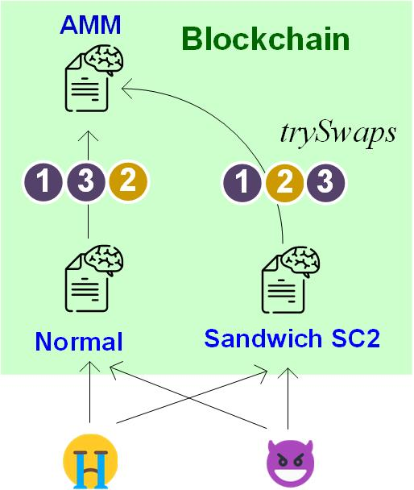

Lab B4: Implement and Mitigate Sandwich Attack
===

Introduction
---


A **Sandwich Attack** is a type of front-running exploit in blockchain networks. In this attack, a malicious account observes a pending transaction (i.e, Tx2) in the mempool and places two transactions, one before (front-run, Tx1) and one after (back-run, Tx3), to profit.

Exercise 1: Swap Activities (Non-Attack) on Normal AMM Pool
---

Initially, Alice owns 10 `TokenX`, and the AMM pool holds 20 `TokenX` and 30 `TokenY`. Now, Bob sends Tx2 to swap 30 `TokenX` for `TokenY`. Suppose Alice sends two transactions Tx1-Tx3 before Tx2, the call sequence is as below:  
- Tx1: `Alice.swapXY(10)`  — Alice gets `dY` `Token_Y`  
- Tx3: `Alice.swapYX(dY)`  
- Tx2: `Bob.swapXY(30)`

Observe how much `TokenX` Alice owns at the end.

Exercise 2: Sandwich Attacks on Normal AMM pool
---
Try the order Tx1-Tx2-Tx3 instead and observe how much `TokenX` Alice owns in the end.

- Tx1: `Alice.swapXY(10)` — Alice gets `dY` `Token_Y`  
- Tx2: `Bob.swapXY(30)`  
- Tx3: `Alice.swapYX(dY)`

Exercise 3: Mitigating Sandwich Attacks with Expected Price
---

This secure version of AMM supports a revised function for token swaps where traders can specify the expected range of price when calling the swap function. For simplicity, we include `expected_dY` as a parameter to indicate how much the user expects to receive:
```
swapXY(uint dX, uint expected_dY)
```
We add an assertion to revert the transaction if the actual ‘dY’ received is less than the expected value, as shown below:
```
require(dY >= expected_dY, "Price may change");
```
The secure AMM also supports a new function to let traders inquire about the current spot price of the pool, specifically, how much dY they can expect to receive for a given `dX`:
```
get_expected_dY(uint dX) return (uint dY)
{
... //your code
return dY;
}
```
Rerun Exercise 1 and 2 on the secured AMM pools and report how much `TokenX` Alice owns in the end.

Deliverable
---

- For all exercises, you should 1) submit your smart-contract code, and 2) show the screenshot of the program execution. 

