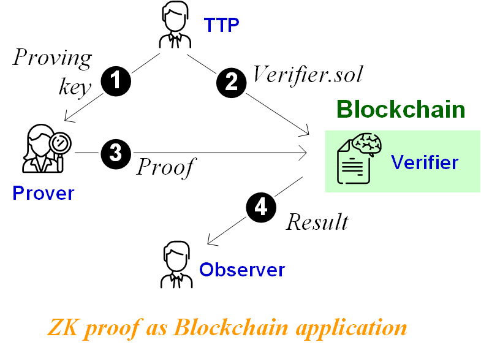

Lab B6: Zero-Knowledge Proofs and their Blockchain Applications 
===

Zero-knowledge proofs (ZK-proofs) is a useful cryptographic tool that can enable privacy-preserving and secure applications on blockchains. 
In a ZK-proof protocol, one party (the prover) proves to another party (the verifier) that a certain statement is true without revealing any information about the statement itself except for its validity. For instance, such a statement can be “Prover Alice knows a secret key SK that maps to a public key PK“. ZK-proof would convince the verifier that the prover Alice knows SK yet without disclosing SK itself to the verifier.



ZK-proof can be naturally integrated with a blockchain in domain applications. The figure above illustrates the common system model of a ZK-proof based blockchain application. A trusted third party (TTP) first generates a pair of keys: proving.key and verification.key. 
In Step 1, he sends proving.key to the Prover. 
In Step 2, he sends to the blockchain a smart contract `verifier.sol` that encodes the verification key.
In Step 3, the Prover generates the proof using proving.key. She sends the proof to the verifier by invoking `verifier.sol` with the proof.
In Step 4, the verification result, such as valid statement, is publicly observed by the domain application. If it is verified, the domain application can proceed and conduct the next step.

The ZK-proof based protocol can be used to safeguard a variety of blockchain applications, such as user authentication, preserving user privacy, etc.
In this lab, we will program a series of privacy-sensitive statements and run ZK-proof provided by zokrates .


Exercise 1: Hello-world ZK program and Setup
---

Install [[ZoKrates](https://zokrates.github.io/gettingstarted.html)] from source:

```bash
git clone https://github.com/ZoKrates/ZoKrates
cd ZoKrates
export ZOKRATES_STDLIB=$PWD/zokrates_stdlib/stdlib
cargo build -p zokrates_cli --release
cd target/release
```

Alternatively, if you are on MacOS or Linux:

```bash
curl -LSfs get.zokrat.es | sh
```

Create a file `root.zok` by copying the following content:

```
def main(private field X, field Y) {
    assert(X * X == Y);
    return;
}
```

Run the following commands in a terminal. Here, we consider three parties, Alice the prover, Bob the verifier on blockchain, Charlie the trusted party to set up the platform.

```bash
# Charlie performs the following:
# Step 1 & 2.
# compile
zokrates compile -i root.zok
# it generates a pair of keys: proving.key and verify.key in the current folder.
zokrates setup
# export a solidity verifier including verify.key
zokrates export-verifier
# deploy verifier.sol to blockchain (Bob), also sends proving.key to Alice


# Step 3.
# execute the program where 337 is X and 113569 is Y
zokrates compute-witness -a 337 113569
# generate a proof of computation (using proving.key)
zokrates generate-proof
# 7. get proof.json from Alice, and embed proof.json in tx to be sent to blockchain.

# Step 4. Contract verifier.sol is invoked by Alice's transaction; the execution result indicates if the proof is verified.
```

After executing `zokrates export-verifier`, you will find a `verifier.sol` generated, deploy it to Remix IDE.

Inspect the `verifier.sol` file and send a transaction to verify the zokrates-generated proof in Remix.

- Hints 1: add ZoKrates to PATH as suggested 
    ```bash
    >>> export PATH=$PATH:/YOUR DIR/.zokrates/bin
    ```
- Hint 2: You can find `a`, `b`, `c`, and input values required for `verifier.verifyTx()` in generated `proof.json` file, which follows the format below:
    ```python
    proof: [[a[0],a[1]], [[b[0][0],b[0][1]],[b[1][0],b[1][1]]], [c[0],c[1]]]
    ```

Exercise 2. Prove Your Age 
---

Imagine an online liquor store selling wine and requiring proof of age from customers. Consider David, the liquor store, Alice, a customer, and Bob the blockchain. Alice generates zero-knowledge proof of her age verifiable on-chain. David observes the verification result from Bob on-chain and can proceed to sell the wine in Alice's cart.

Complete the following program to implement the ZK proof-of-age. Then, test and run your ZK program in the setup from Exercise 1.

```
def main(private field age, field min_age) {
    // implement your proof below
    return;
}
```

<!--


In this exercise, we simulate a scenario where you are a prover who tries to prove that your age is bigger than a given number(21, in this case). You will submit your proof to a smart contract deployed by a verifier, while your age is not included in the proof. 

You should use a common .zok [file](https://github.com/ZhouYuxuan97/zk-demo/blob/main/comp.zok) to compile, and use a given setup ([proving.key](https://github.com/ZhouYuxuan97/zk-demo/blob/main/proving.key)) to replace the command of `zokrates setup`. 

Using the given [verifier.sol](https://github.com/ZhouYuxuan97/zk-demo/blob/main/verifier.sol) smart contract to Remix IDE and put your proof arguments to `verifyTx` function. 


Steps to finish the Exercise for your reference:
- Compile the .zok program:
```bash
>>> zokrates compile -i comp.zok
```
- Perform the setup phase using the given `proving.key` file
- Execute the program with specified arguments, the format of arguments can be referred to the definition in `comp.zok`
- Generate a proof of computation:
```bash
>>> zokrates generate-proof
```
- Note: Stop at this step and proceed with the provided Solidity file for further instructions.

Hint:
1. You could use this command to download the files to avoid font/format issues, replace the link to adjust other files  
    ```bash
    >>> wget -O proving.key https://github.com/ZhouYuxuan97/zk-demo/blob/main/proving.key?raw=true
    ```
-->

Exercise 3. Prove Your Knowledge of Hash Preimage 
---

A more common way of using ZK-proof is to prove the knowledge of a hash preimage. That is, given hash $y=H(x)$, Alice tries to prove to Bob that she knows the preimage $x$ under the hash digest $y$, without revealing $x$ to Bob.

Complete the following template program to implement the ZK-proof of knowledge of hash preimage.

```
import "hashes/sha256/512bitPacked" as sha256packed;

def main(private field a, private field b, private field c, private field d) -> field[2] {
    field[2] h = sha256packed([a, b, c, d]);
//implement your code below

    return h;
}
```

The first line imports the `sha256packed` function from the `ZoKrates` standard library.

Hint:

- You can run the given program with the secret to find out the hash digest, and then use the digest to check.

<!--

Exercise 3. Prove Your Knowledge of Hash Preimage 
---

In this exercise, we simulate a scenario where Alice tries to prove she knows a hash preimage for a digest chosen by Bob. Similarly, the preimage wouldn’t be revealed when Bob verifies the proof.

To start with, you can create a new file named `generate-hash.zok` to learn about how to generate hash in `.zok`:
```
import "hashes/sha256/512bitPacked" as sha256packed;

def main(private field a, private field b, private field c, private field d) -> field[2] {
    field[2] h = sha256packed([a, b, c, d]);
    return h;
}
```

The first line imports the `sha256packed` function from the ZoKrates standard library.

`sha256packed` is a SHA256 implementation that is optimized for the use in the ZoKrates DSL. Here is how it works: We want to pass 512 bits of input to SHA256. However, a `field` value can only hold 254 bits due to the size of the underlying prime field we are using. As a consequence, we use four field elements, each one encoding 128 bits, to represent our input. The four elements are then concatenated in ZoKrates and passed to SHA256. Given that the resulting hash is 256 bit long, we split it in two and return each value as a 128 bit number.

Then compile generate-hash.zok and create a witness file, record the output.

Now, based on the code snippet in `generate-hash.zok` and witness output, Bob needs to design a `prove-preimage.zok`, compile it, make a setup and export `verifier.sol`, and deploy `verifier.sol` to Remix IDE. Alice is going to compile the `prove-preimage.zok` as well, enter her preimage to generate witness, using Bob's `proving.key` to construct the proof, then put the arguments in proof to `verifier.verifyTx()` to show her knowledge of that hash preimage to Bob.
 
Help Bob to design `prove-preimage.zok` and follow these steps to finish the demo.
 
 Hints:
1. You could use this command to generate witness of `generate-hash`
    ```bash
    >>> zokrates compute-witness -a 0 1 2 4 --verbose
    ```
 
Deliverable
---

1. You should create separate folders for all exercises. 
2. Submission should be a pdf file.
3. For all exercises, you should submit the screenshots of what files remain in your folder; the screenshots of the terminal showing what commands are executed and their outputs; the screenshots of your contract executing inputs and results in Remix IDE.
4. For all exercises, copy your code in `.zok` files and proofs in `proof.json` to the pdf submission.
5. For Exercise 3, create two folders called `Alice` and `Bob` individually, follow the instructions and understand the scenario(difference in roles' duties), and submit the screenshots of what files remain in `Alice` and `Bob` folders.


-->


