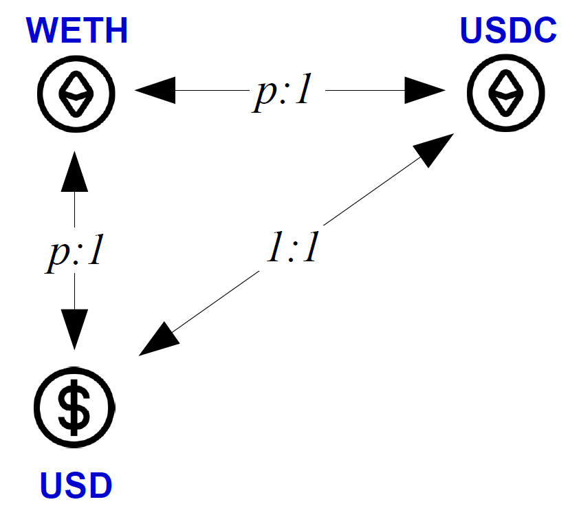

Lab B7: Lending Pool and Liquidation 
===

Introduction
---

<p float="left">
  
  
</p>
In a lending pool, an account (e.g., Alice) can deposit one token, say WETH, as collateral, to borrow another token, such as USDT. The USD value of the borrowed USDT is determined by the WETH-to-USD price and the amount of WETH deposited. If the price drops significantly, a liquidation mechanism is triggered, which allows anyone to purchase the collateral WETH at a price below the market price. 

A lending pool functions in three essential operations: 1) An external account borrows tokens by depositing collateral, 2) A trusted off-chain party, called the price oracle, reports price ticks periodically to the pool, and 3) the pool triggers liquidation when the price reported is too low. In this lab, you will build a simple lending pool that implements these three core functions.

Exercise 1. Implement borrow and repay  
---

One example of the borrow and repay process is shown as follows. Suppose the collateral ratio is 75%, and the price is 1 WETH = 1000 USDT. Alice deposits 1 WETH to borrow USDT.

Borrow:
- At the beginning, Alice has 1 WETH, 0 USDT
- Alice calls `WETH.approve(pool, 1)`
- Alice calls `LendingPool.deposit_borrow(1)`, the lending pool checks the current price, and transfers USDT to Alice
- Alice has 0 WETH and 1 * 1000 * 75% = 750 USDT

Repay:
- Alice has 0 WETH, 750 USDT
- Alice calls `USDT.approve(pool, 750)`
- Alice calls `LendingPool.repay()`, LendingPool receives 750 USDT and returns 1 WETH to Alice
- Alice has 1 WETH and 0 USDT

Please design code to implement this process.

`Hint`: You can use the following structure to store Alice's bill:
```
struct Position {
    uint collateral; // in collateralToken, e.g., WETH
    uint debt;       // in borrowToken, e.g., USDT
}
```


Exercise 2. Implement price reporting from oracle
---

To simulate real-world conditions, we add a price-setting mechanism to the contract in this step. For simplicity, we assume USDT is pegged to 1 USD, and the price of WETH (in USD) is represented by a variable called price in the contract.

Please implement a `setPrice(unit _price)` function to allow setting the price of WETH.

`Hint`: Only the contract owner should be allowed to call this function.

Exercise 3. Implement liquidation
---

Now, let’s simulate the liquidation process.
Suppose Alice has borrowed 750 USDT using 1 WETH as collateral. The liquidation threshold is 80%, meaning liquidation can be triggered if the value of the collateral drops below 80% of the loan value. Suppose the liquidation reward is 10%.
Here’s how the process works:
- The owner calls `pool.setPrice(500)`, updating the price of WETH to $500. Now, the collateral value is 1 WETH × $500 = $500, while the debt remains 750 USDT. The collateral ratio now is calculated as: 500 / 750 = 66.7%, Since 66.7% < 80%, the loan is eligible for liquidation.
- Bob calls `pool.liquidate(Alice)` and deposits 750 USDT to repay all the Alice's debt. The pool checks that the liquidation is allowed. Bob receives 1.1 WETH (1 WETH + 10% bonus)
Please implement a `liquidation(address user)` function to the pool to finish the lending pool. 


Exercise 4: Health Factor and Partial Liquidation
---

But there's a problem on exercise 3: if WETH is only worth $500, Bob just paid $750 to get $550 in value. That’s a loss!
And to make liquidation rational and safe, real-world protocols rely on a more robust metric called the Health Factor.

The Health Factor (HF) is calculated as:

```
HF = (Collateral Value × Liquidation Threshold) / Debt Value
```

If HF < 1, then the user’s position is undercollateralized.

Let’s walk through an example: Alice has 1 WETH as collateral, and she borrowed 750 USDT. If the price of WETH drops to $900, her collateral is now worth $900. The liquidation threshold is 80%, so: HF = (900 × 0.8) / 750 = 0.96 < 1, This means her position can now be liquidated. Bob decides to repay 750 USDT. At $900/WETH, 750 USDT corresponds to 750/900 = 0.833 WETH. With a 10% bonus, he receives 0.916 WETH. Alice now has only 0.084 WETH left, and her debt is cleared.

The function Bob uses is:

```solidity
function liquidate(address user, uint repayAmount) external;
```

Bob can choose to repay any amount (full or partial), making liquidation flexible and potentially more profitable.


Deliverable
---

- For all exercises, you should 1) submit your smart-contract code, and 2) show the screenshot of the program execution. 
